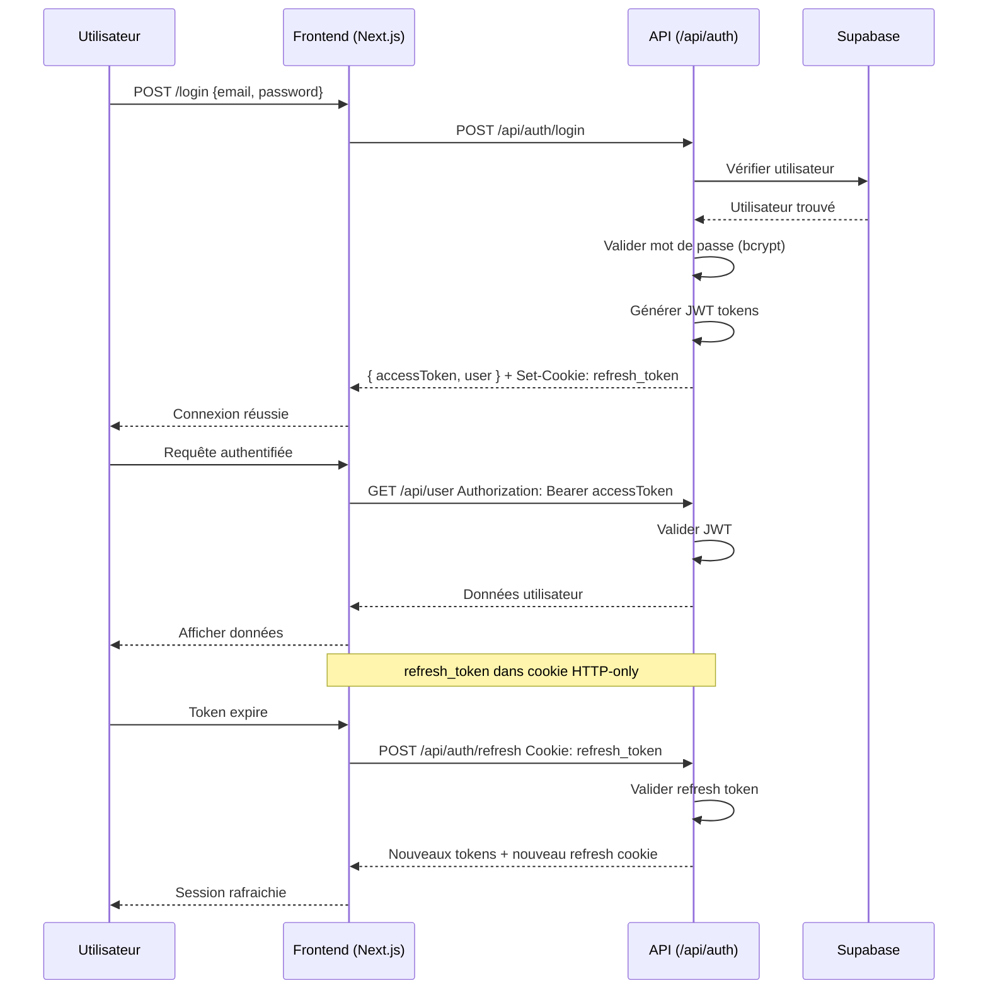

# Plan de Migration NestJS → Next.js App Router API Routes

## Vue d'Ensemble

**Objectif:** Migrer le backend NestJS existant vers des API Routes Next.js (App Router) pour unifier le frontend et backend sur le même domaine.

**Contraintes:**
- Next.js App Router avec NextResponse
- Authentification par cookies HTTP-only (JWT)
- Pas d'Axios côté serveur (utiliser fetch)
- Code modulaire, prêt à être séparé plus tard
- Suppression des dépendances CORS

---

## Architecture Cible

```
botlist-ai-front/
├── src/
│   ├── app/
│   │   ├── api/
│   │   │   ├── auth/
│   │   │   │   ├── register/route.ts
│   │   │   │   ├── login/route.ts
│   │   │   │   ├── refresh/route.ts
│   │   │   │   ├── logout/route.ts
│   │   │   │   └── ...
│   │   │   ├── user/
│   │   │   │   ├── route.ts
│   │   │   │   └── [id]/route.ts
│   │   │   ├── tools/
│   │   │   │   ├── route.ts
│   │   │   │   ├── [slug]/route.ts
│   │   │   │   └── [id]/route.ts
│   │   │   ├── categories/
│   │   │   │   ├── route.ts
│   │   │   │   └── [id]/route.ts
│   │   │   ├── reviews/
│   │   │   │   ├── route.ts
│   │   │   │   └── ...
│   │   │   ├── assistant/
│   │   │   │   └── ask/route.ts
│   │   │   └── health/route.ts
│   │   └── ...
│   ├── lib/
│   │   ├── services/
│   │   │   ├── supabase.ts
│   │   │   ├── auth/
│   │   │   │   ├── jwt.ts
│   │   │   │   └── cookies.ts
│   │   │   ├── user.service.ts
│   │   │   ├── tools.service.ts
│   │   │   ├── categories.service.ts
│   │   │   ├── reviews.service.ts
│   │   │   └── session.service.ts
│   │   └── ...
│   └── types/
└── ...
```

---

## Étapes de Migration

### Phase 1: Infrastructure de Base

#### 1.1 Créer les utilitaires partagés (lib/services)

**Fichiers à créer:**
- [`botlist-ai-front/src/lib/services/supabase.ts`](botlist-ai-front/src/lib/services/supabase.ts) - Client Supabase
- [`botlist-ai-front/src/lib/services/auth/jwt.ts`](botlist-ai-front/src/lib/services/auth/jwt.ts) - Fonctions JWT
- [`botlist-ai-front/src/lib/services/auth/cookies.ts`](botlist-ai-front/src/lib/services/auth/cookies.ts) - Gestion cookies

**Configuration requise:**
```
NEXT_PUBLIC_SUPABASE_URL
NEXT_PUBLIC_SUPABASE_ANON_KEY
SUPABASE_SERVICE_ROLE_KEY
JWT_SECRET
REFRESH_SECRET
REFRESH_TOKEN_EXP
```

#### 1.2 Créer les types partagés

**Fichiers à créer:**
- [`botlist-ai-front/src/types/auth.ts`](botlist-ai-front/src/types/auth.ts) - Types JWT et auth
- [`botlist-ai-front/src/types/user.ts`](botlist-ai-front/src/types/user.ts) - Types User
- [`botlist-ai-front/src/types/api.ts`](botlist-ai-front/src/types/api.ts) - Types génériques API

---

### Phase 2: Services Métier

#### 2.1 User Service
**Source:** [`botlist-ai-backend/src/user/user.service.ts`](botlist-ai-backend/src/user/user.service.ts)
**Cible:** [`botlist-ai-front/src/lib/services/user.service.ts`](botlist-ai-front/src/lib/services/user.service.ts)

**Méthodes à implémenter:**
```typescript
findAll(): Promise<User[]>
findOneByEmail(email: string): Promise<User | null>
findOneById(id: string): Promise<User | null>
checkEmail(email: string): Promise<boolean>
create(dto: CreateUserDto): Promise<User>
update(id: string, dto: UpdateUserDto): Promise<User>
remove(id: string): Promise<void>
save(user: User): Promise<User>
changePassword(userId: string, currentPwd: string, newPwd: string): Promise<User>
```

#### 2.2 Session Service
**Source:** [`botlist-ai-backend/src/session/session.service.ts`](botlist-ai-backend/src/session/session.service.ts)
**Cible:** [`botlist-ai-front/src/lib/services/session.service.ts`](botlist-ai-front/src/lib/services/session.service.ts)

**Méthodes à implémenter:**
```typescript
create(user: User): Promise<Session>
update(sessionId: string, refreshToken: string, ip?: string, userAgent?: string): Promise<Session>
findValidSession(sessionId: string): Promise<Session | null>
revokeSession(sessionId: string): Promise<void>
revokeAllSessionsForUser(userId: string): Promise<void>
```

#### 2.3 Auth Service
**Source:** [`botlist-ai-backend/src/auth/auth.service.ts`](botlist-ai-backend/src/auth/auth.service.ts)
**Cible:** [`botlist-ai-front/src/lib/services/auth/auth.service.ts`](botlist-ai-front/src/lib/services/auth/auth.service.ts)

**Méthodes à implémenter:**
```typescript
register(dto: RegisterDto): Promise<RegisterResponse>
login(dto: LoginDto): Promise<LoginResponse>
refresh(refreshToken: string): Promise<LoginResponse>
logout(refreshToken: string): Promise<void>
validate(payload: JwtPayload): Promise<User>
generateTokens(user: User): Promise<{accessToken, refreshToken, user}>
activate(token: string, code: string): Promise<LoginResponse>
sendActivationCode(email: string): Promise<{activationToken: string}>
sendResetCode(email: string): Promise<{verifyResetCodeToken: string}>
verifyResetCode(dto: VerifyResetCodeDto): Promise<{resetToken: string}>
resetPassword(dto: ResetPasswordDto): Promise<LoginResponse>
```

#### 2.4 Tools Service
**Source:** [`botlist-ai-backend/src/tools/tools.service.ts`](botlist-ai-backend/src/tools/tools.service.ts)
**Cible:** [`botlist-ai-front/src/lib/services/tools.service.ts`](botlist-ai-front/src/lib/services/tools.service.ts)

**Méthodes à implémenter:**
```typescript
findAll(): Promise<Tools[]>
findBySlug(slug: string): Promise<Tools>
findOne(id: string): Promise<Tools>
create(dto: CreateToolDto): Promise<Tools>
update(id: string, dto: UpdateToolDto): Promise<Tools>
remove(id: string): Promise<{message: string}>
```

#### 2.5 Categories Service
**Source:** [`botlist-ai-backend/src/categories/categories.service.ts`](botlist-ai-backend/src/categories/categories.service.ts)
**Cible:** [`botlist-ai-front/src/lib/services/categories.service.ts`](botlist-ai-front/src/lib/services/categories.service.ts)

**Méthodes à implémenter:**
```typescript
findAll(): Promise<Category[]>
findOne(id: string): Promise<Category>
create(dto: CreateCategoryDto): Promise<Category>
update(id: string, dto: UpdateCategoryDto): Promise<Category>
remove(id: string): Promise<{message: string}>
```

#### 2.6 Reviews Service
**Source:** [`botlist-ai-backend/src/reviews/reviews.service.ts`](botlist-ai-backend/src/reviews/reviews.service.ts)
**Cible:** [`botlist-ai-front/src/lib/services/reviews.service.ts`](botlist-ai-front/src/lib/services/reviews.service.ts)

**Méthodes à implémenter:**
```typescript
findAll(): Promise<Review[]>
findByTool(toolId: string): Promise<Review[]>
create(dto: CreateReviewDto): Promise<Review>
createComment(dto: CreateReviewCommentDto): Promise<any>
getCommentsForReview(reviewId: string): Promise<any[]>
```

---

### Phase 3: API Routes

#### 3.1 Auth Routes (`/api/auth/*`)

**POST /api/auth/register**
- Input: `{ email, firstname?, lastname, password }`
- Output: `{ accessToken, refreshToken, user }`
- Cookies: Set `refresh_token` HTTP-only

**POST /api/auth/login**
- Input: `{ email, password }`
- Output: `{ accessToken, refreshToken, user }`
- Cookies: Set `refresh_token` HTTP-only

**POST /api/auth/refresh**
- Cookies: Read `refresh_token`
- Output: `{ accessToken, refreshToken, user }`
- Cookies: Update `refresh_token`

**POST /api/auth/logout**
- Cookies: Read `refresh_token`, Clear `refresh_token`
- Output: `{ message: 'Logged out' }`

**POST /api/auth/activate**
- Input: `{ activateToken, otp }`

**POST /api/auth/send-activation-code**
- Input: `{ email }`

**POST /api/auth/send-reset-code**
- Input: `{ email }`

**POST /api/auth/verify-reset-code**
- Input: `{ verifyResetCodeToken, otp }`

**POST /api/auth/reset-password**
- Input: `{ resetToken, password }`

#### 3.2 User Routes (`/api/user/*`)

**GET /api/user**
- Auth: Required (JWT)
- Output: `User[]`

**POST /api/user**
- Auth: Required (JWT, Admin)
- Input: `{ email, firstname?, lastname, password, role? }`

**GET /api/user/[id]**
- Auth: Required (JWT)
- Output: `User`

**PATCH /api/user/[id]**
- Auth: Required (JWT, Owner or Admin)
- Input: `{ firstname?, lastname?, bio?, website?, ... }`

**DELETE /api/user/[id]**
- Auth: Required (JWT, Admin)

#### 3.3 Tools Routes (`/api/tools/*`)

**GET /api/tools**
- Output: `Tools[]`

**POST /api/tools**
- Auth: Required (JWT)
- Input: `CreateToolDto`

**GET /api/tools/[slug]**
- Output: `Tools`

**PATCH /api/tools/[id]**
- Auth: Required (JWT)
- Input: `UpdateToolDto`

**DELETE /api/tools/[id]**
- Auth: Required (JWT)

#### 3.4 Categories Routes (`/api/categories/*`)

**GET /api/categories**
- Output: `Category[]`

**POST /api/categories**
- Auth: Required (JWT)
- Input: `{ name, slug?, description?, ... }`

**GET /api/categories/[id]**
- Output: `Category`

**PATCH /api/categories/[id]**
- Auth: Required (JWT)
- Input: `{ name?, slug?, ... }`

**DELETE /api/categories/[id]**
- Auth: Required (JWT)

#### 3.5 Reviews Routes (`/api/reviews/*`)

**GET /api/reviews**
- Query: `tool_id?`
- Output: `Review[]`

**POST /api/reviews**
- Auth: Required (JWT)
- Input: `{ tool_id, rating, comment? }`

**GET /api/reviews/[id]**
- Output: `Review`

**POST /api/reviews/comments**
- Auth: Required (JWT)
- Input: `{ review_id, user_id, comment }`

#### 3.6 Assistant Route (`/api/assistant/*`)

**POST /api/assistant/ask**
- Keep existing implementation (appelle OpenRouter ou fallback)

#### 3.7 Health Route (`/api/health`)

**GET /api/health**
- Output: `{ status: 'ok', timestamp, version }`

---

### Phase 4: Utilitaires et Helpers

#### 4.1 Auth Middleware
**Fichier:** [`botlist-ai-front/src/lib/middleware/auth.ts`](botlist-ai-front/src/lib/middleware/auth.ts)

```typescript
// Vérifier JWT dans Authorization header
export function getAuthUser(request: NextRequest): Promise<User | null>

// Vérifier que l'utilisateur est authentifié
export function requireAuth(request: NextRequest): Promise<User>

// Vérifier que l'utilisateur a un rôle spécifique
export function requireRole(request: NextRequest, roles: string[]): Promise<User>
```

#### 4.2 Response Helpers
**Fichier:** [`botlist-ai-front/src/lib/api/responses.ts`](botlist-ai-front/src/lib/api/responses.ts)

```typescript
export function json<T>(data: T, status?: number): NextResponse
export function error(message: string, status?: number): NextResponse
export function success(message: string, data?: any): NextResponse
export function unauthorized(message?: string): NextResponse
export function forbidden(message?: string): NextResponse
export function notFound(message?: string): NextResponse
export function conflict(message?: string): NextResponse
```

#### 4.3 Cookie Helpers
**Fichier:** [`botlist-ai-front/src/lib/api/cookies.ts`](botlist-ai-front/src/lib/api/cookies.ts)

```typescript
export function setRefreshCookie(token: string, response: NextResponse): NextResponse
export function clearRefreshCookie(response: NextResponse): NextResponse
export function getRefreshToken(request: NextRequest): string | null
export function getAccessToken(request: NextRequest): string | null
```

---

### Phase 5: Mise à jour du Frontend

#### 5.1 Mettre à jour api-client.ts
**Fichier:** [`botlist-ai-front/src/lib/api-client.ts`](botlist-ai-front/src/lib/api-client.ts)

**Changements:**
- Utiliser des URLs relatives (`/api/auth/login` au lieu de `/auth/login`)
- Supprimer le baseURL dynamique
- Gérer les cookies automatiquement

#### 5.2 Mettre à jour auth-context.tsx
**Fichier:** [`botlist-ai-front/src/context/auth-context.tsx`](botlist-ai-front/src/context/auth-context.tsx)

**Changements:**
- Vérifier les cookies HTTP-only pour l'authentification
- Utiliser `/api/auth/logout` pour la déconnexion

---

### Phase 6: Nettoyage

#### 6.1 Supprimer le backend NestJS
- Supprimer le dossier `botlist-ai-backend/`
- Supprimer les références dans docker-compose

#### 6.2 Supprimer CORS
- Plus besoin de configuration CORS
- Front et back partagent le même domaine

#### 6.3 Mettre à jour la documentation
- README.md mis à jour
- Endpoints documentés

---

## Diagramme de Flux d'Authentification



---

## Variables d'Environnement Requis

```env
# Supabase
NEXT_PUBLIC_SUPABASE_URL=https://xxx.supabase.co
NEXT_PUBLIC_SUPABASE_ANON_KEY=xxx
SUPABASE_SERVICE_ROLE_KEY=xxx

# JWT
JWT_SECRET=your-super-secret-jwt-key
REFRESH_SECRET=your-super-secret-refresh-key
REFRESH_TOKEN_EXP=7d

# OpenRouter (optionnel)
OPENROUTER_API_KEY=xxx
OPENROUTER_MODEL=perplexity/sonar
```

---

## Tests de Validation

### Test 1: Inscription
```bash
curl -X POST http://localhost:3000/api/auth/register \
  -H "Content-Type: application/json" \
  -d '{"email":"test@example.com","password":"password123","firstname":"John","lastname":"Doe"}'
```

### Test 2: Connexion
```bash
curl -X POST http://localhost:3000/api/auth/login \
  -H "Content-Type: application/json" \
  -d '{"email":"test@example.com","password":"password123"}' \
  -c cookies.txt
```

### Test 3: Accès authentifié
```bash
curl -X GET http://localhost:3000/api/user \
  -H "Authorization: Bearer <access_token>" \
  -b cookies.txt
```

### Test 4: Health check
```bash
curl http://localhost:3000/api/health
```

---

## Notes de Migration

1. **Bcrypt:** Installer `bcryptjs` pour le hash des mots de passe
2. **JWT:** Installer `jsonwebtoken` pour la manipulation des tokens
3. **OTP:** Installer `otp-generator` pour les codes d'activation
4. **Slugify:** Installer `slugify` pour la génération de slugs
5. **UUID:** Le backend utilise des UUIDs pour les IDs

## Livrables

1. ✅ Dossier `botlist-ai-front/src/lib/services/` avec tous les services
2. ✅ Dossier `botlist-ai-front/src/app/api/` avec toutes les routes
3. ✅ Types TypeScript partagés
4. ✅ Documentation des endpoints
5. ✅ Frontend mis à jour pour utiliser les nouvelles routes
6. ✅ Backend NestJS supprimé
